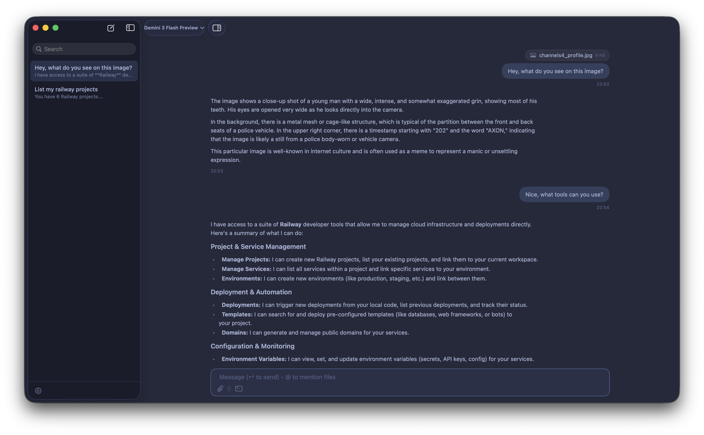

# Humlex

Simple native macOS AI chat app.



## What it does

- Chat with multiple providers in one app
- Stream responses in real time
- Attach images and files
- Use MCP tools in chat
- Keep API keys in macOS Keychain

## Supported providers

- OpenAI
- Anthropic
- OpenRouter
- Vercel AI Gateway
- Gemini
- Claude Code
- OpenAI Codex

## Requirements

- macOS 14+
- Swift 6+

## Run

```sh
./run.sh
```

## Skills (skills.sh)

```sh
# Install community skills for Codex (interactive)
./skills.sh bootstrap

# Or run any skills CLI command directly
./skills.sh list
./skills.sh add vercel-labs/agent-skills
./skills.sh check
./skills.sh update
```

You can also use `just` shortcuts: `just skills-list`, `just skills-check`, `just skills-update`.

## Build release DMG

```sh
./build-dmg.sh [version]
```

## Verify update signing key (before release)

```sh
SPARKLE_PRIVATE_KEY="<base64-private-key>" ./scripts/verify-sparkle-keypair.sh
```

## License

Copyright (c) 2026 Lasse Vestergaard. All rights reserved.
